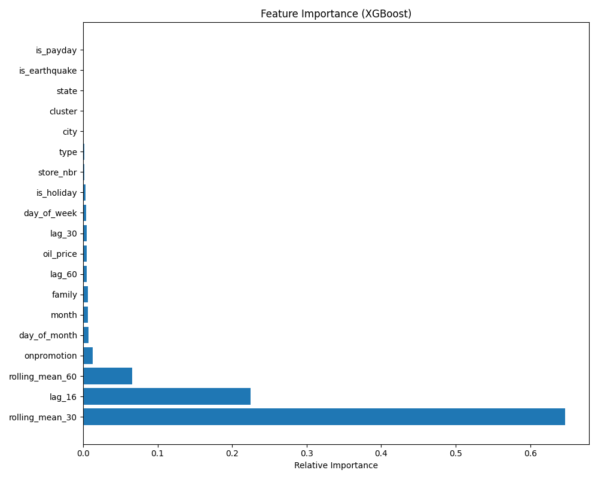

# favorita-sales-prediction
## Store Sales Forecasting: End-to-End MLE Pipeline
Personal ML side project

A production-ready Machine Learning pipeline to forecast daily sales for thousands of product families at Favorita stores in Ecuador.

This project demonstrates a shift from traditional analysis to **Machine Learning Engineering (MLE)** practices, focusing on modular code, high-performance data processing (Polars), and reproducible environments (Docker).

## Project Overview

* **Goal**: Minimize RMSLE (Root Mean Squared Logarithmic Error) for 16-day future sales forecasting.
* **Performance**: Achieved **Validation RMSLE: 0.4155** and Top 15% zone on Kaggle.
* **Key Challenge**: Handling complex seasonality, local/national holidays, and exogenous shocks (2016 Earthquake).

## Datasets


## Tech Stack & Engineering Decisions

* **Data Processing**: Used **Polars** instead of Pandas for 50x faster ETL on 3M+ rows and lazy execution capabilities.
* **Modeling**: **XGBoost Regressor** with Log-Loss objective (`reg:squaredlogerror` proxy) to handle long-tail sales distribution.
* **Feature Engineering**:
    * **Lag-16 Strategy**: Designed features strictly based on the 16-day forecast horizon to prevent data leakage.
    * **Context-Aware Holidays**: logic to map holidays strictly to their specific cities/states.
    * **Rolling Statistics**: Rolling mean/std over 30/60 days to capture long-term trends.
* **MLOps**:
    * Modular Python scripts (not just Notebooks).
    * Artifact serialization (Model + Encoder).
    * Dockerized inference pipeline.

## Feature Importance

The model identifies **long-term trends (Rolling Means)** and **short-term history (Lags)** as the strongest predictors, aligning with retail business intuition.


## Project Structure

```bash
.
├── data/               # Raw data (gitignored)
├── models/             # Trained artifacts (model.pkl, encoder.pkl)
├── outputs/            # Processed parquet & submission.csv
├── src/                # (Optional) Helper modules
├── 01_preprocessing.py # ETL: Cleaning & Merging (Polars)
├── 02_feature_engineering.py # Lags, Rolling, Holiday Logic
├── 03_training.py      # XGBoost Training & Validation
├── 04_inference.py     # Batch Inference Script
├── Dockerfile          # Reproducible Environment
└── requirements.txt
```

## How to Run

### Method 1: Local Environment

```bash
# 1. Install dependencies
pip install -r requirements.txt

# 2. Run the pipeline step-by-step
python 01_preprocessing.py
python 02_feature_engineering.py
python 03_training.py
python 04_inference.py
```

### Method 2: Docker (Recommended)
Build and run the containerized inference pipeline.

```bash
# Build image
docker build -t favorita-app .

# Run inference (Mounting outputs to host)
docker run -v $(pwd)/outputs:/app/outputs favorita-app
```

## Results

* Validation RMSLE: 0.4155
* Kaggle Score: 0.49017
